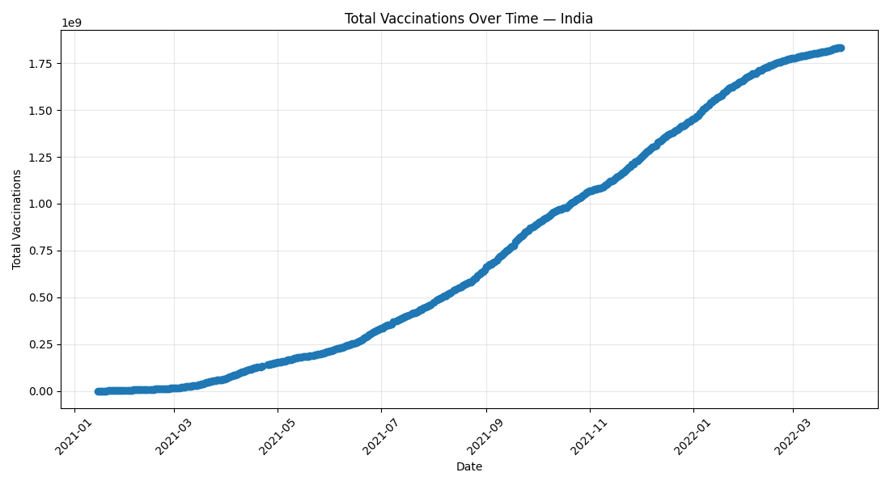
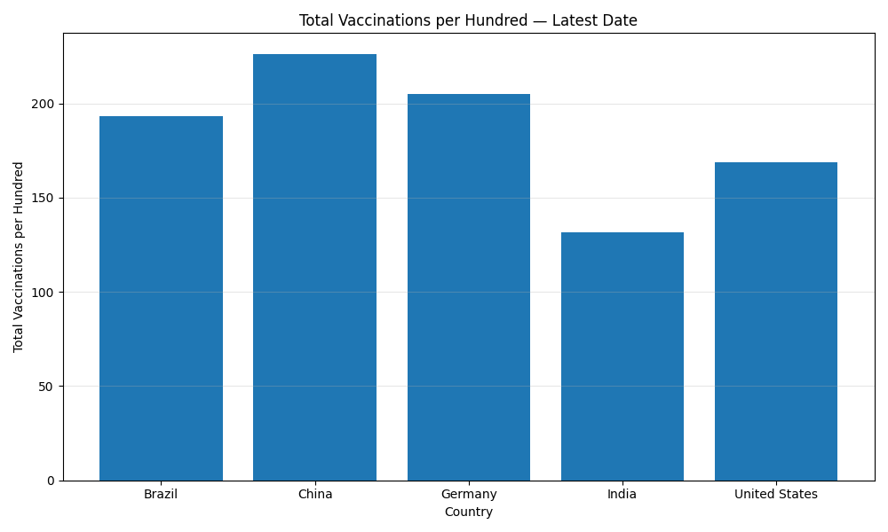
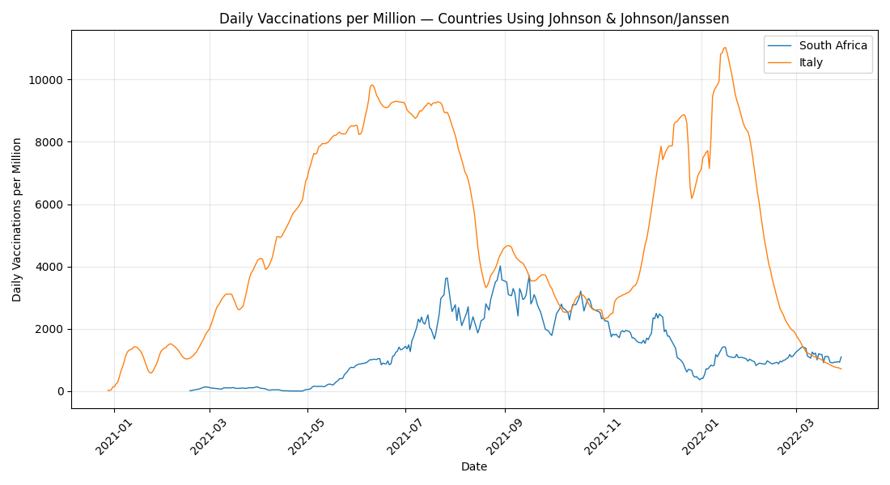

# OJCommerce_Analytics
# COVID-19 World Vaccination Progress

This repository contains a Jupyter Notebook (`final_code.ipynb`). Below is a complete, line-by-line walkthrough of the code cells, along with setup instructions and usage notes.

## What this notebook does
- Uses pandas for data loading/manipulation.
- Generates visualizations with matplotlib.

## Requirements
Install the following Python packages (create/activate a virtual environment first):

```bash
pip install numpy pandas
```

## How to run

1. Clone the repo and enter the folder.
2. (Recommended) Create a virtual environment and activate it.
3. Install requirements (see above).
4. Launch Jupyter and open the notebook:
   ```bash
   jupyter notebook final_code.ipynb
   ```
5. Run cells from top to bottom.

## Notebook structure & explanations
The following sections show each code cell followed by a line‑by‑line explanation.

### Code Cell 1

```python
# import necessary packages
import numpy as np
import pandas as pd
import matplotlib.pyplot as plt
```

**Line-by-line explanation**

- **L1:** `# import necessary packages` — Comment: import necessary packages
- **L2:** `import numpy as np` — Imports a library or symbol used later in the code.
- **L3:** `import pandas as pd` — Imports a library or symbol used later in the code.
- **L4:** `import matplotlib.pyplot as plt` — Imports a library or symbol used later in the code.

### Code Cell 2

```python
# Read the data
df=pd.read_csv('country_vaccinations.csv')
```

**Line-by-line explanation**

- **L1:** `# Read the data` — Comment: Read the data
- **L2:** `df=pd.read_csv('country_vaccinations.csv')` — Assigns a value to a variable.

### Code Cell 3

```python
# print head
print("First 5 rows of the dataset:")
print(df.head())
```

**Line-by-line explanation**

- **L1:** `# print head` — Comment: print head
- **L2:** `print("First 5 rows of the dataset:")` — Prints output to the console.
- **L3:** `print(df.head())` — Prints output to the console.

### Code Cell 4

```python
print(f"Dataset Shape: {df.shape[0]} rows and {df.shape[1]} columns.")
print("\nData Types of Columns:")
print(df.dtypes)
print("-" * 50)
```

**Line-by-line explanation**

- **L1:** `print(f"Dataset Shape: {df.shape[0]} rows and {df.shape[1]} columns.")` — Prints output to the console.
- **L2:** `print("\nData Types of Columns:")` — Prints output to the console.
- **L3:** `print(df.dtypes)` — Prints output to the console.
- **L4:** `print("-" * 50)` — Prints output to the console.

### Code Cell 5

```python
# Convert 'date' to datetime (coerce invalid values to NaT)
df["date"] = pd.to_datetime(df["date"], errors="coerce")
```

**Line-by-line explanation**

- **L1:** `# Convert 'date' to datetime (coerce invalid values to NaT)` — Comment: Convert 'date' to datetime (coerce invalid values to NaT)
- **L2:** `df["date"] = pd.to_datetime(df["date"], errors="coerce")` — Assigns a value to a variable.

### Code Cell 6

```python
# Report missing values before cleaning
print("Missing values per column before cleaning:")
print(df.isnull().sum())
```

**Line-by-line explanation**

- **L1:** `# Report missing values before cleaning` — Comment: Report missing values before cleaning
- **L2:** `print("Missing values per column before cleaning:")` — Prints output to the console.
- **L3:** `print(df.isnull().sum())` — Prints output to the console.

### Code Cell 7

```python
# Fill daily_vaccinations with median per country; if a country has all NaN, use 0
def _fill_country_median(s: pd.Series) -> pd.Series:
    med = s.median()
    return s.fillna(0 if pd.isna(med) else med)
```

**Line-by-line explanation**

- **L1:** `# Fill daily_vaccinations with median per country; if a country has all NaN, use 0` — Comment: Fill daily_vaccinations with median per country; if a country has all NaN, use 0
- **L2:** `def _fill_country_median(s: pd.Series) -> pd.Series:` — Defines a function.
- **L3:** `    med = s.median()` — Assigns a value to a variable.
- **L4:** `    return s.fillna(0 if pd.isna(med) else med)` — Returns a value from a function.

### Code Cell 8

```python
df["daily_vaccinations"] = (
    df.groupby("country")["daily_vaccinations"]
      .transform(_fill_country_median)
)
```

**Line-by-line explanation**

- **L1:** `df["daily_vaccinations"] = (` — Assigns a value to a variable.
- **L2:** `    df.groupby("country")["daily_vaccinations"]` — Executes an operation (see code for specifics).
- **L3:** `      .transform(_fill_country_median)` — Executes an operation (see code for specifics).
- **L4:** `)` — Executes an operation (see code for specifics).

### Code Cell 9

```python
print("\nMissing values in 'daily_vaccinations' after cleaning:",
      df["daily_vaccinations"].isnull().sum())
print("-" * 50)
```

**Line-by-line explanation**

- **L1:** `print("\nMissing values in 'daily_vaccinations' after cleaning:",` — Prints output to the console.
- **L2:** `      df["daily_vaccinations"].isnull().sum())` — Executes an operation (see code for specifics).
- **L3:** `print("-" * 50)` — Prints output to the console.

### Code Cell 10

```python
# Sort for time operations
df = df.sort_values(["country", "date"]).reset_index(drop=True)
```

**Line-by-line explanation**

- **L1:** `# Sort for time operations` — Comment: Sort for time operations
- **L2:** `df = df.sort_values(["country", "date"]).reset_index(drop=True)` — Assigns a value to a variable.

### Code Cell 11

```python

# Latest row per country (used multiple times)
latest = df.loc[df.groupby("country")["date"].idxmax()].copy()
```

**Line-by-line explanation**

- **L1:** `` — Blank line (kept for readability).
- **L2:** `# Latest row per country (used multiple times)` — Comment: Latest row per country (used multiple times)
- **L3:** `latest = df.loc[df.groupby("country")["date"].idxmax()].copy()` — Assigns a value to a variable.

### Code Cell 12

```python
# 4) Top 5 by people_fully_vaccinated (latest date for each country)
top5_fully = (
    latest[["country", "people_fully_vaccinated"]]
    .sort_values("people_fully_vaccinated", ascending=False)
    .head(5)
    .reset_index(drop=True)
)
print("Top 5 countries by people_fully_vaccinated (latest date):")
print(top5_fully)
print("-" * 50)
```

**Line-by-line explanation**

- **L1:** `# 4) Top 5 by people_fully_vaccinated (latest date for each country)` — Comment: 4) Top 5 by people_fully_vaccinated (latest date for each country)
- **L2:** `top5_fully = (` — Assigns a value to a variable.
- **L3:** `    latest[["country", "people_fully_vaccinated"]]` — Executes an operation (see code for specifics).
- **L4:** `    .sort_values("people_fully_vaccinated", ascending=False)` — Assigns a value to a variable.
- **L5:** `    .head(5)` — Executes an operation (see code for specifics).
- **L6:** `    .reset_index(drop=True)` — Assigns a value to a variable.
- **L7:** `)` — Executes an operation (see code for specifics).
- **L8:** `print("Top 5 countries by people_fully_vaccinated (latest date):")` — Prints output to the console.
- **L9:** `print(top5_fully)` — Prints output to the console.
- **L10:** `print("-" * 50)` — Prints output to the console.

### Code Cell 13

```python
# 5) India trend — total_vaccinations over time (line chart)
india = df[df["country"] == "India"].copy()

plt.figure(figsize=(11, 6))
plt.plot(india["date"], india["total_vaccinations"], marker="o", linewidth=1)
plt.title("Total Vaccinations Over Time — India")
plt.xlabel("Date")
plt.ylabel("Total Vaccinations")
plt.xticks(rotation=45)
plt.grid(True, alpha=0.3)
plt.tight_layout()
plt.savefig("india_total_vaccinations_trend.png")
print("Saved: india_total_vaccinations_trend.png")
print("-" * 50)
```

**Line-by-line explanation**

- **L1:** `# 5) India trend — total_vaccinations over time (line chart)` — Comment: 5) India trend — total_vaccinations over time (line chart)
- **L2:** `india = df[df["country"] == "India"].copy()` — Assigns a value to a variable.
- **L3:** `` — Blank line (kept for readability).
- **L4:** `plt.figure(figsize=(11, 6))` — Assigns a value to a variable.
- **L5:** `plt.plot(india["date"], india["total_vaccinations"], marker="o", linewidth=1)` — Assigns a value to a variable.
- **L6:** `plt.title("Total Vaccinations Over Time — India")` — Configures or draws a matplotlib plot.
- **L7:** `plt.xlabel("Date")` — Configures or draws a matplotlib plot.
- **L8:** `plt.ylabel("Total Vaccinations")` — Configures or draws a matplotlib plot.
- **L9:** `plt.xticks(rotation=45)` — Assigns a value to a variable.
- **L10:** `plt.grid(True, alpha=0.3)` — Assigns a value to a variable.
- **L11:** `plt.tight_layout()` — Configures or draws a matplotlib plot.
- **L12:** `plt.savefig("india_total_vaccinations_trend.png")` — Configures or draws a matplotlib plot.
- **L13:** `print("Saved: india_total_vaccinations_trend.png")` — Prints output to the console.
- **L14:** `print("-" * 50)` — Prints output to the console.

### Code Cell 14

```python
# 6) Bar chart — total_vaccinations_per_hundred for selected countries (latest date)
countries_6 = ["United States", "India", "China", "Germany", "Brazil"]
comp = latest[latest["country"].isin(countries_6)][
    ["country", "total_vaccinations_per_hundred"]
].copy()
```

**Line-by-line explanation**

- **L1:** `# 6) Bar chart — total_vaccinations_per_hundred for selected countries (latest date)` — Comment: 6) Bar chart — total_vaccinations_per_hundred for selected countries (latest date)
- **L2:** `countries_6 = ["United States", "India", "China", "Germany", "Brazil"]` — Assigns a value to a variable.
- **L3:** `comp = latest[latest["country"].isin(countries_6)][` — Assigns a value to a variable.
- **L4:** `    ["country", "total_vaccinations_per_hundred"]` — Executes an operation (see code for specifics).
- **L5:** `].copy()` — Executes an operation (see code for specifics).

### Code Cell 15

```python
# For plotting clarity, replace NaN with 0 (we still use original comp to find leader)
comp_plot = comp.fillna({"total_vaccinations_per_hundred": 0})
```

**Line-by-line explanation**

- **L1:** `# For plotting clarity, replace NaN with 0 (we still use original comp to find leader)` — Comment: For plotting clarity, replace NaN with 0 (we still use original comp to find leader)
- **L2:** `comp_plot = comp.fillna({"total_vaccinations_per_hundred": 0})` — Assigns a value to a variable.

### Code Cell 16

```python
plt.figure(figsize=(10, 6))
plt.bar(comp_plot["country"], comp_plot["total_vaccinations_per_hundred"])
plt.title("Total Vaccinations per Hundred — Latest Date")
plt.xlabel("Country")
plt.ylabel("Total Vaccinations per Hundred")
plt.grid(axis="y", alpha=0.3)
plt.tight_layout()
plt.savefig("per_hundred_comparison.png")
print("Saved: per_hundred_comparison.png")
```

**Line-by-line explanation**

- **L1:** `plt.figure(figsize=(10, 6))` — Assigns a value to a variable.
- **L2:** `plt.bar(comp_plot["country"], comp_plot["total_vaccinations_per_hundred"])` — Configures or draws a matplotlib plot.
- **L3:** `plt.title("Total Vaccinations per Hundred — Latest Date")` — Configures or draws a matplotlib plot.
- **L4:** `plt.xlabel("Country")` — Configures or draws a matplotlib plot.
- **L5:** `plt.ylabel("Total Vaccinations per Hundred")` — Configures or draws a matplotlib plot.
- **L6:** `plt.grid(axis="y", alpha=0.3)` — Assigns a value to a variable.
- **L7:** `plt.tight_layout()` — Configures or draws a matplotlib plot.
- **L8:** `plt.savefig("per_hundred_comparison.png")` — Configures or draws a matplotlib plot.
- **L9:** `print("Saved: per_hundred_comparison.png")` — Prints output to the console.

### Code Cell 17

```python
leader = comp.sort_values("total_vaccinations_per_hundred", ascending=False).head(1)
print("\nLeader among the five (per hundred, latest date):")
print(leader)
print("-" * 50)
```

**Line-by-line explanation**

- **L1:** `leader = comp.sort_values("total_vaccinations_per_hundred", ascending=False).head(1)` — Assigns a value to a variable.
- **L2:** `print("\nLeader among the five (per hundred, latest date):")` — Prints output to the console.
- **L3:** `print(leader)` — Prints output to the console.
- **L4:** `print("-" * 50)` — Prints output to the console.

### Code Cell 18

```python
# 7) share_fully_vaccinated = people_fully_vaccinated / people_vaccinated (guard divide-by-zero)
df["share_fully_vaccinated"] = np.where(
    (df["people_vaccinated"] > 0) & (~df["people_fully_vaccinated"].isna()),
    df["people_fully_vaccinated"] / df["people_vaccinated"],
    np.nan
)
```

**Line-by-line explanation**

- **L1:** `# 7) share_fully_vaccinated = people_fully_vaccinated / people_vaccinated (guard divide-by-zero)` — Comment: 7) share_fully_vaccinated = people_fully_vaccinated / people_vaccinated (guard divide-by-zero)
- **L2:** `df["share_fully_vaccinated"] = np.where(` — Assigns a value to a variable.
- **L3:** `    (df["people_vaccinated"] > 0) & (~df["people_fully_vaccinated"].isna()),` — Executes an operation (see code for specifics).
- **L4:** `    df["people_fully_vaccinated"] / df["people_vaccinated"],` — Executes an operation (see code for specifics).
- **L5:** `    np.nan` — Executes an operation (see code for specifics).
- **L6:** `)` — Executes an operation (see code for specifics).

### Code Cell 19

```python
latest_share = df.loc[df.groupby("country")["date"].idxmax(), 
                      ["country", "people_vaccinated", "people_fully_vaccinated", "share_fully_vaccinated"]].copy()

top3_share = latest_share.sort_values("share_fully_vaccinated", ascending=False).head(3).reset_index(drop=True)
print("Top 3 countries by share_fully_vaccinated (latest date):")
print(top3_share)
print("\nInterpretation:")
print("- Higher share means a greater proportion of vaccinated people completed the full schedule,")
print("  indicating strong follow-through and/or emphasis on second doses/complete schedules.")
print("-" * 50)
```

**Line-by-line explanation**

- **L1:** `latest_share = df.loc[df.groupby("country")["date"].idxmax(), ` — Assigns a value to a variable.
- **L2:** `                      ["country", "people_vaccinated", "people_fully_vaccinated", "share_fully_vaccinated"]].copy()` — Executes an operation (see code for specifics).
- **L3:** `` — Blank line (kept for readability).
- **L4:** `top3_share = latest_share.sort_values("share_fully_vaccinated", ascending=False).head(3).reset_index(drop=True)` — Assigns a value to a variable.
- **L5:** `print("Top 3 countries by share_fully_vaccinated (latest date):")` — Prints output to the console.
- **L6:** `print(top3_share)` — Prints output to the console.
- **L7:** `print("\nInterpretation:")` — Prints output to the console.
- **L8:** `print("- Higher share means a greater proportion of vaccinated people completed the full schedule,")` — Prints output to the console.
- **L9:** `print("  indicating strong follow-through and/or emphasis on second doses/complete schedules.")` — Prints output to the console.
- **L10:** `print("-" * 50)` — Prints output to the console.

### Code Cell 20

```python
# 8) Unique vaccine combinations + top 3 (count ONCE per country using latest row)
vaccines_by_country = latest[["country", "vaccines"]].dropna()
unique_combos_count = vaccines_by_country["vaccines"].nunique()
print(f"Number of unique vaccine combinations: {unique_combos_count}")

print("\nTop 3 most common vaccine combinations (by country, latest row):")
print(vaccines_by_country["vaccines"].value_counts().head(3))
print("-" * 50)
```

**Line-by-line explanation**

- **L1:** `# 8) Unique vaccine combinations + top 3 (count ONCE per country using latest row)` — Comment: 8) Unique vaccine combinations + top 3 (count ONCE per country using latest row)
- **L2:** `vaccines_by_country = latest[["country", "vaccines"]].dropna()` — Assigns a value to a variable.
- **L3:** `unique_combos_count = vaccines_by_country["vaccines"].nunique()` — Assigns a value to a variable.
- **L4:** `print(f"Number of unique vaccine combinations: {unique_combos_count}")` — Prints output to the console.
- **L5:** `` — Blank line (kept for readability).
- **L6:** `print("\nTop 3 most common vaccine combinations (by country, latest row):")` — Prints output to the console.
- **L7:** `print(vaccines_by_country["vaccines"].value_counts().head(3))` — Prints output to the console.
- **L8:** `print("-" * 50)` — Prints output to the console.

### Code Cell 21

```python
# 9) J&J countries — include Johnson & Johnson / Johnson&Johnson / Janssen variants
mask_jj = df["vaccines"].str.contains(
    r"Johnson\s*&\s*Johnson|Johnson&Johnson|Janssen", case=False, na=False, regex=True
)
jj = df[mask_jj].copy()
```

**Line-by-line explanation**

- **L1:** `# 9) J&J countries — include Johnson & Johnson / Johnson&Johnson / Janssen variants` — Comment: 9) J&J countries — include Johnson & Johnson / Johnson&Johnson / Janssen variants
- **L2:** `mask_jj = df["vaccines"].str.contains(` — Assigns a value to a variable.
- **L3:** `    r"Johnson\s*&\s*Johnson\|Johnson&Johnson\|Janssen", case=False, na=False, regex=True` — Assigns a value to a variable.
- **L4:** `)` — Executes an operation (see code for specifics).
- **L5:** `jj = df[mask_jj].copy()` — Assigns a value to a variable.

### Code Cell 22

```python
# Preferred pair; if either missing, auto-pick the top 2 J&J countries by number of records
preferred = ["South Africa", "Italy"]
if set(preferred).issubset(set(jj["country"].unique())):
    countries_to_compare = preferred
else:
    countries_to_compare = (
        jj.groupby("country").size().sort_values(ascending=False).head(2).index.tolist()
    )

print("Comparing J&J countries:", countries_to_compare)
```

**Line-by-line explanation**

- **L1:** `# Preferred pair; if either missing, auto-pick the top 2 J&J countries by number of records` — Comment: Preferred pair; if either missing, auto-pick the top 2 J&J countries by number of records
- **L2:** `preferred = ["South Africa", "Italy"]` — Assigns a value to a variable.
- **L3:** `if set(preferred).issubset(set(jj["country"].unique())):` — Begins a conditional block that runs only if the condition is true.
- **L4:** `    countries_to_compare = preferred` — Assigns a value to a variable.
- **L5:** `else:` — Continues a conditional branch.
- **L6:** `    countries_to_compare = (` — Assigns a value to a variable.
- **L7:** `        jj.groupby("country").size().sort_values(ascending=False).head(2).index.tolist()` — Assigns a value to a variable.
- **L8:** `    )` — Executes an operation (see code for specifics).
- **L9:** `` — Blank line (kept for readability).
- **L10:** `print("Comparing J&J countries:", countries_to_compare)` — Prints output to the console.

### Code Cell 23

```python
plt.figure(figsize=(11, 6))
for c in countries_to_compare:
    sub = jj[jj["country"] == c].sort_values("date")
    plt.plot(sub["date"], sub["daily_vaccinations_per_million"], label=c, linewidth=1)
plt.title("Daily Vaccinations per Million — Countries Using Johnson & Johnson/Janssen")
plt.xlabel("Date")
plt.ylabel("Daily Vaccinations per Million")
plt.legend()
plt.xticks(rotation=45)
plt.grid(True, alpha=0.3)
plt.tight_layout()
plt.savefig("jj_comparison.png")
print("Saved: jj_comparison.png")
```

**Line-by-line explanation**

- **L1:** `plt.figure(figsize=(11, 6))` — Assigns a value to a variable.
- **L2:** `for c in countries_to_compare:` — Starts a loop to iterate over items or repeat actions.
- **L3:** `    sub = jj[jj["country"] == c].sort_values("date")` — Assigns a value to a variable.
- **L4:** `    plt.plot(sub["date"], sub["daily_vaccinations_per_million"], label=c, linewidth=1)` — Assigns a value to a variable.
- **L5:** `plt.title("Daily Vaccinations per Million — Countries Using Johnson & Johnson/Janssen")` — Configures or draws a matplotlib plot.
- **L6:** `plt.xlabel("Date")` — Configures or draws a matplotlib plot.
- **L7:** `plt.ylabel("Daily Vaccinations per Million")` — Configures or draws a matplotlib plot.
- **L8:** `plt.legend()` — Configures or draws a matplotlib plot.
- **L9:** `plt.xticks(rotation=45)` — Assigns a value to a variable.
- **L10:** `plt.grid(True, alpha=0.3)` — Assigns a value to a variable.
- **L11:** `plt.tight_layout()` — Configures or draws a matplotlib plot.
- **L12:** `plt.savefig("jj_comparison.png")` — Configures or draws a matplotlib plot.
- **L13:** `print("Saved: jj_comparison.png")` — Prints output to the console.

### Code Cell 24

```python
# print latest available values for the plotted countries
jj_latest = jj.loc[jj.groupby("country")["date"].idxmax(), 
                   ["country", "date", "daily_vaccinations_per_million"]]
print("\nLatest Daily Vaccinations per Million — J&J Countries (for plotted countries):")
print(jj_latest[jj_latest["country"].isin(countries_to_compare)].reset_index(drop=True))
print("-" * 50)
```

**Line-by-line explanation**

- **L1:** `# print latest available values for the plotted countries` — Comment: print latest available values for the plotted countries
- **L2:** `jj_latest = jj.loc[jj.groupby("country")["date"].idxmax(), ` — Assigns a value to a variable.
- **L3:** `                   ["country", "date", "daily_vaccinations_per_million"]]` — Executes an operation (see code for specifics).
- **L4:** `print("\nLatest Daily Vaccinations per Million — J&J Countries (for plotted countries):")` — Prints output to the console.
- **L5:** `print(jj_latest[jj_latest["country"].isin(countries_to_compare)].reset_index(drop=True))` — Assigns a value to a variable.
- **L6:** `print("-" * 50)` — Prints output to the console.

## Output







